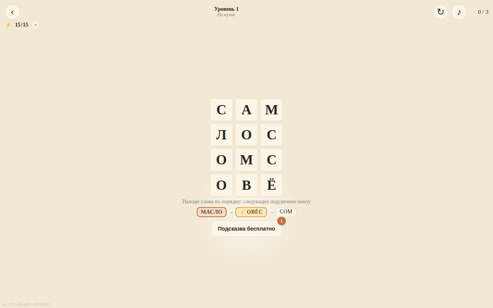

# Словоход

Ищите слова на поле из букв. Последняя буква найденного слова начинает следующее.

[Играть в тестовую сборку](https://fanatat.github.io/games-dev/slovokhod/)

Здесь размещена статическая версия для запуска в браузере.
Тестовая сборка может отличаться от файлов этого репозитория.
Слова — на русском; интерфейс — на русском и английском.
[Веб-версия](https://slovokhod-vk.vercel.app)

**Статус на 28 сентября 2026, подтверждён владельцем:** игра опубликована
в VK. В Яндекс Играх и CrazyGames пока не опубликована.



*Локальный запуск файлов этого репозитория, 28 сентября 2026.*

## Что это

Поле из букв, слово проводишь пальцем по соседним клеткам. Слова уровня образуют цепочку: первая буква каждого — последняя предыдущего, следующее слово подсвечивается снизу. 100 уровней в 10 тематических главах по 10 (кухня, море, лес, профессии и другие), поля от 3×4 до 6×8, слова покрывают поле целиком.
Счёт за уровень и личный рекорд, подсказки за рекламу, запас энергии на попытки с пополнением по времени, календарь наград за 7 дней входов. Звук — WebAudio без файлов. Интерфейс RU/EN, слова уровней — русские.

## Стек

- vanilla JS, без сборщика (версии ассетов и номер билда штампует внешний `build.py`, в репозиторий не входит)
- DOM: поле на CSS Grid и Pointer Events, без Canvas
- VK Bridge (`vk-bridge.min.js`, локально); сохранение — VKWebAppStorage; реклама — interstitial, rewarded, баннер

## Запуск локально

```bash
git clone https://github.com/Fanatat/slovokhod-vk.git
cd slovokhod-vk
python3 -m http.server 8000 --bind 127.0.0.1
```

Открыть `http://localhost:8000`. Вне VK игра стартует в dev-режиме (без рекламы и облачного сохранения).

## Моя роль

Игра собрана командой ИИ-агентов (Claude Code) под руководством автора: постановка задачи, приёмка живым запуском и тестами, релиз — автор; код — агенты.

SDK площадок обеспечивают авторизацию, рекламу, покупки и облачные сохранения
в соответствующем окружении. Локальный HTTP-сервер не воспроизводит эти интеграции.

## Состав репозитория

`index.html` — вход; JavaScript-модули — поле, уровни и интеграция VK.
Внешний `build.py` сюда не входит; локальный запуск не требует пересборки.
Здесь звук синтезируется через Web Audio; тестовая сборка `games-dev`
может использовать записанные аудиоресурсы.
